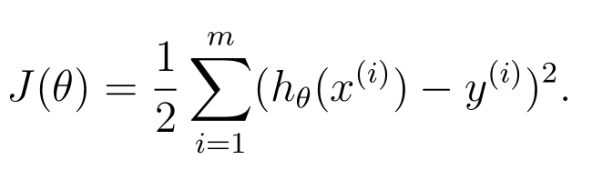
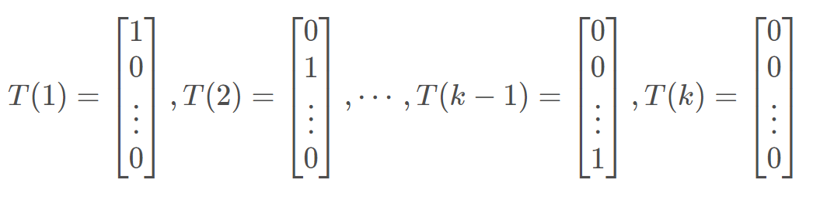
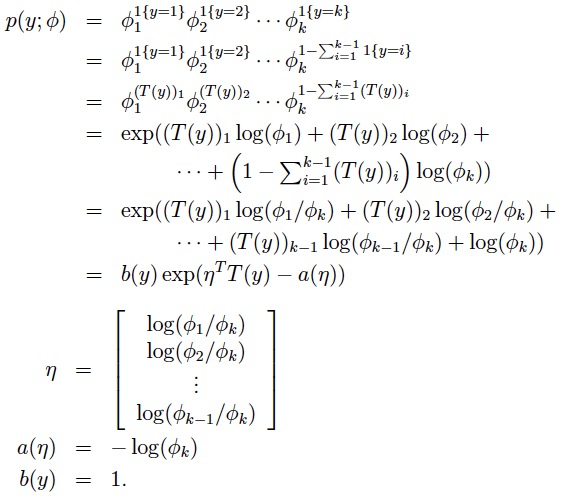
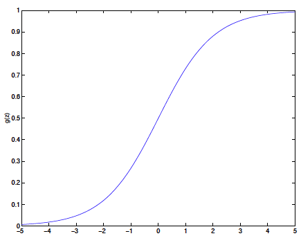
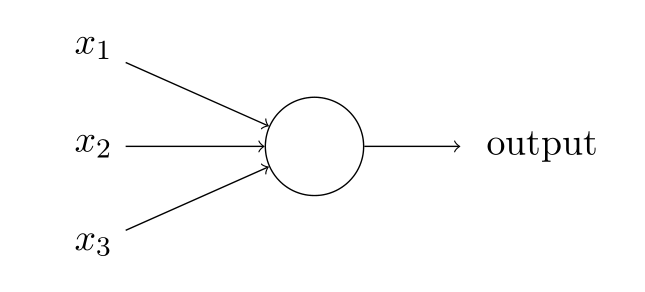
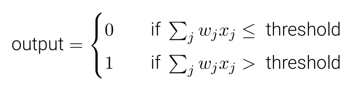
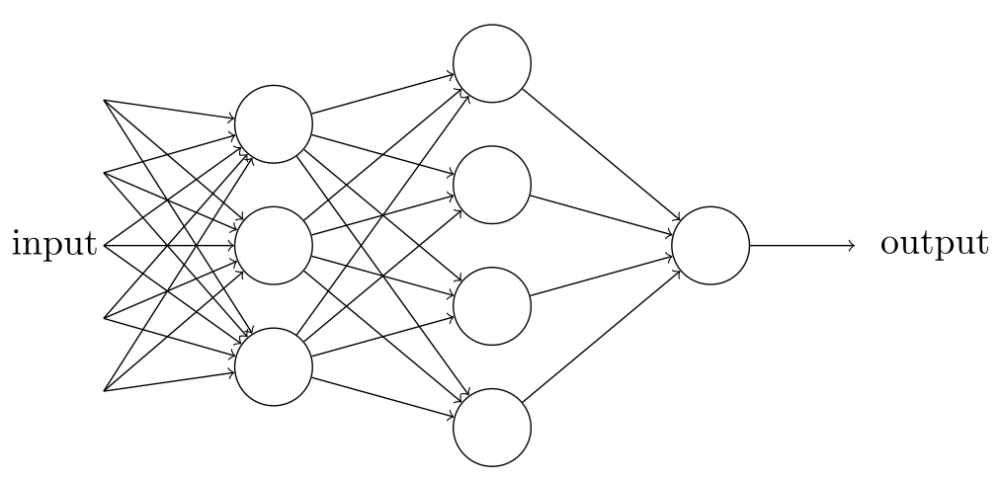
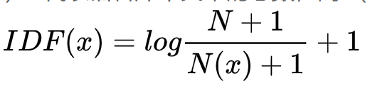
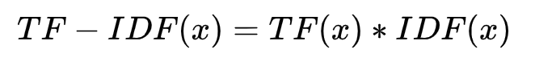

# 《动手学深度学习》第一次打卡

## 一、线性回归

什么是回归分析？回归分析是统计学上的术语，它的分析对象是两个及以上的变量，目的在于找出这些变量之间的相互关系。比如分析房子大小和房价的关系，就可以利用回归分析。

回归分析的目的在于找出一个最能够代表所有观测资料的函数（回归估计式），用此函数代表因变量和自变量之间的关系。

“回归”一词最早由法兰西斯·高尔顿（Francis Galton）所使用。他曾对亲子间的身高做研究，发现父母的身高虽然会遗传给子女，但子女的身高却有逐渐“回归到中等（即人的平均值）”的现象。不过当时的回归和现在的回归在意义上已不尽相同。

什么是线性回归？简单地说，试图利用一个线性模型来拟合两个或多个变量之间的变化，这样的分析方法叫做线性回归。

什么是线性模型？两个或多个变量之间，其中一个变量能够利用其他变量的线性组合来预测，符合这样的数学性质的模型称之为线性模型。

回归模型由以下内容组成：

未知参数，记为$\beta$ ，可以代表一个标量或一个向量。
自变量，${\displaystyle \mathbf {X} }$。
因变量，$Y$。

回归模型将Y和一个关于${\displaystyle \mathbf {X} }$和$\beta $的函数关联起来。

在不同的应用领域有各自不同的术语代替这里的“自变量”和“因变量”。

$Y\approx f({\mathbf  {X}},{\boldsymbol  {\beta }})$
这个估计值通常写作:${\displaystyle E(X|Y)=f(\mathbf {X} ,{\boldsymbol {\beta }})}$。

在我们确定变量之间是线性关系时，如何确定模型的参数$\beta$，从而找到模型呢？一般情况下，我们会从一个具体的问题出发，在分析现有数据的前提下，利用最小二乘法，求解参数。所谓最小二乘法，即最小化一个平方项。哪个平方项呢？即假设模型和理想模型之间差距的平方项。



## 二、softmax与分类模型

上面讨论的是回归分析方法，变量的变化也是连续的。不过下面我们要讨论的是离散的变量之间的关系。比如经济条件对男女比例的影响，男性和女性显然不是一个连续变化的物理量，而且也很难说谁大谁小。像这种变量之间的研究方法，叫做分类分析。

设想一个分类问题，每个$x$对应的$y$的取值有$k$种可能，即$y\in\{1,2,\dots,k\}$。

首先，我们以多分类问题出发，假设我们要对多个类进行区分，那么对于多类问题，多项分布是一个很好的概率分布模型。同时，对于充分统计量，我们将其写为各个方向的基向量的形式，即



由此可以推出多元分布的指数分布族形式：



## 三、多层感知机

The perceptron learning algorithm 感知机

从模型上来看感知机与逻辑回归十分相似，只不过逻辑回归的g函数是逻辑函数（又称sigmoid函数），它是一条从y值0到1的连续曲线。当z→∞，g(z)→1；当z → −∞，g(z)→0。
g(z) = 1/(1+e-z)



虽然和逻辑回归形式上相近，但是很难为感知机的预测加上概率解释，也很难说感知机算法是源于最大化似然函数。

感知器是如何⼯作的呢？⼀个感知器接受⼏个⼆进制输⼊，x1 ,x2 ,...，并产⽣⼀个⼆进制输出





这就是⼀个感知器所要做的所有事情。



在这个网络中，第一列感知器——我们称其为第一层感知器——通过权衡输入依据做出三个非常简单的决定。那第二层的感知器呢？每一个都在权衡第一层的决策结果并做出决定。以这种方式，一个第二层中的感知器可以比第一层中的做出更复杂和抽象的决策。在第三层中的感知器甚至能进行更复杂的决策。以这种方式，一个多层的感知器网络可以从事复杂巧妙的决策。顺便提一下，当我定义感知器时我说的是感知器只有一个输出。在上面的网络中感知器看上去像是有多个输出。实际上，他们仍然是单输出的。多个感知器输出箭头仅仅便于说明一个感知器的输出被用于其它感知器的输入。它和把单个输出线条分叉相比，显得讨巧些。


## 四、文本预处理

中英文的文本预处理大体流程如上图，但是还是有部分区别。首先，中文文本是没有像英文的单词空格那样隔开的，因此不能直接像英文一样可以直接用最简单的空格和标点符号完成分词。所以一般我们需要用分词算法来完成分词

对于中文来说常用的中文分词软件有很多，例如，结巴分词。安装也很简单，比如基于Python的，用"pip install jieba"就可以完成。

然后去掉停用词，缩小词库大小。停用词就是句子没什么必要的单词，去掉他们以后对理解整个句子的语义没有影响。文本中，会存在大量的虚词、代词或者没有特定含义的动词、名词，这些词语对文本分析起不到任何的帮助，我们往往希望能去掉这些“停用词”。

词干提取(stemming)和词型还原(lemmatization)是英文文本预处理的特色。两者其实有共同点，即都是要找到词的原始形式。只不过词干提取(stemming)会更加激进一点，它在寻找词干的时候可以会得到不是词的词干。比如"leaves"的词干可能得到的是"leav", 并不是一个词。而词形还原则保守一些，它一般只对能够还原成一个正确的词的词进行处理。nltk中提供了很多方法，wordnet的方式比较好用，不会把单词过分精简。


Tf-idf（Term Frequency-Inverse Document Frequency）
该模型基于词频，将文本转换成向量，而不考虑词序。假设现在有N篇文档，在其中一篇文档D中，词汇x的TF、IDF、TF-IDF定义如下：

1.Term Frequency(TF(x)):指词x在当前文本D中的词频
2.Inverse Document Frequency(IDF): N代表语料库中文本的总数，而N(x)代表语料库中包含词x的文本总数，平滑后的IDF如下： 
3.TF-IDF ： 

使用sklearn库里的TfidfVectorizer类可以帮助我们完成向量化，TF-IDF和标准化三步。

```python
from sklearn.feature_extraction.text import TfidfVectorizer

corpus = ["This is sample document.", "another random document.", "third sample document text"]
vector = TfidfVectorizer()
tf_data = vector.fit_transform(corpus)
print(tf_data)    #(句子下标, 单词特征下标)   权重
print(vector.vocabulary_)    #单词特征
df1 = pd.DataFrame(tf_data.toarray(), columns=vector.get_feature_names()) # to DataFrame
df1
```

## 五、语言模型

N-gram语言模型

词袋模型不考虑每个单词的顺序。有时候把一句话顺序捣乱，我们可能就看不懂这句话在说什么了，例如：

我玩电脑 = 电脑玩我 ？
N-gram模型是一种语言模型（Language Model），语言模型是一个基于概率的判别模型，它的输入是一句话（单词的顺序序列），输出是这句话的概率，即这些单词的联合概率（joint probability）。N-gram本身也指一个由N个单词组成的集合，各单词具有先后顺序，且不要求单词之间互不相同。常用的有 Bi-gram (N=2N=2) 和 Tri-gram (N=3N=3)，一般已经够用了。例如,"I love deep learning"，可以分解的 Bi-gram 和 Tri-gram ：

>Bi-gram : {I, love}, {love, deep}, {love, deep}, {deep, learning}
Tri-gram : {I, love, deep}, {love, deep, learning}

sklearn库中的CountVectorizer 有一个参数ngram_range，如果赋值为(2,2)则为Bigram，当然使用语言模型会大大增加我们字典的大小。

```python
ram_range=(1,1) 表示 unigram, ngram_range=(2,2) 表示 bigram, ngram_range=(3,3) 表示 thirgram
from sklearn.feature_extraction.text import CountVectorizer
import pandas as pd
import jieba

data = ["当然使用语言模型会大大增加我们字典的大小",
        "各单词具有先后顺序"]
data = [" ".join(jieba.lcut(e)) for e in data]         # 分词，并用" "连接
vector = CountVectorizer(min_df=1, ngram_range=(2,2))  # bigram
X = vector.fit_transform(data)                         # 将分词好的文本转换为矩阵
print(vector.vocabulary_ )                             # 得到特征
print(X)                                               #(句子下标, 单词特征下标)   频数
df1 = pd.DataFrame(X.toarray(), columns=vector.get_feature_names()) # to DataFrame
df1.head()
```

Word2vec词向量
Word2Vec使用一系列的文档的词语去训练模型，把文章的词映射到一个固定长度的连续向量。一般维数较小，通常为100 ~ 500。意义相近的词之间的向量距离较小。它以稠密的向量形式表示单词。有两种模式：

>CBOW（Continuous Bag-Of-Words）：利用词的上下文预测当前的词。
Skip-Gram：利用当前的词来预测上下文。

因为word2vector模型的得到的是词向量，如何表示句子呢？最简单的方法就是，将每个句子中的词向量相加取平均值，即每个句子的平均词向量来表示句子的向量。

```python
from gensim.models import Word2Vec                  
import numpy as np

data = ["I love deep learning","I love studying","I want to travel"]
#词频少于min_count次数的单词会被丢弃掉
#size指特征向量的维度为50
#workers参数控制训练的并行数
train_w2v = Word2Vec(data,min_count=5,size=50, workers=4)
for row in data:         #计算平均词向量，表示句子向量
    vec = np.zeros(50)
    count = 0
    for word in row:
        try:
            vec += train_w2v[word]
            count += 1
        except:
            pass
    avg_data.append(vec/count)  
print(avg_data[1])
```

## 六、循环神经网络

见ppt