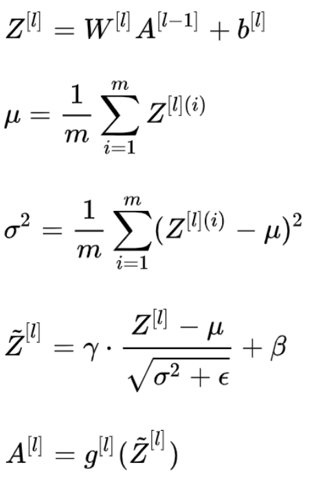
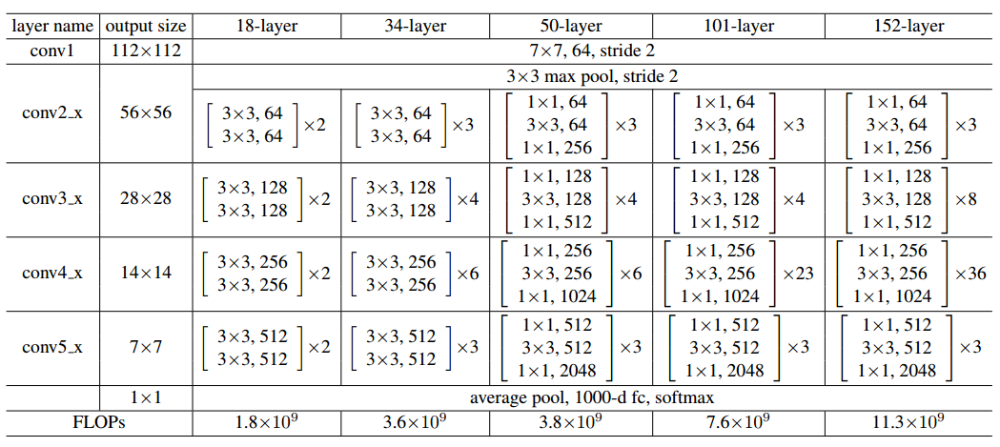
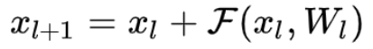
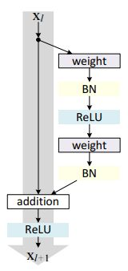

# 《动手学深度学习》第三次打卡

## 批量归一化

随着训练的进行，网络中的参数也随着梯度下降在不停更新。一方面，当底层网络中参数发生微弱变化时，由于每一层中的线性变换与ReLU，这些微弱变化随着网络层数的加深而被放大；另一方面，参数的变化导致每一层的输入分布会发生改变，进而上层的网络需要不停地去适应这些分布变化，使得我们的模型训练变得困难。该现象原因是由于参数更新带来的网络中每一层输入值分布的改变，并且随着网络层数的加深而变得更加严重，因此我们可以通过固定每一层网络输入值的分布来减缓该问题。

在深度学习中，由于采用full batch的训练方式对内存要求较大，且每一轮训练时间过长；我们一般都会采用对数据做划分，用mini-batch对网络进行训练。因此，Batch Normalization也就在mini-batch的基础上进行计算。

定义网络总共有L层（不包含输入层），$d_l$第l层的维度，即神经元结点数，W为权重矩阵，Z为线性计算结果，A为将线性计算结果输入ReLU之后的非线性计算结果。M为训练样本的数目，N为特征数目，X为训练集，X的每一列是一个样本，m是batch_size的大小，$\xi^{i}$为第i个mini_batch的训练数据。

对于网络第l层，有以下公式：

## 残差网络

网络的表达能力是随着网络深度的增加而增强的。然而，网络并非越深越好。抛开计算代价的问题不谈，在网络深度较深时，继续增加层数并不能提高性能。由于训练误差也随着层数增加而提升，所以这个现象可能并非参数的增加造成的过拟合。此外，这个网络在训练时也使用了ReLU激活、Batch_Normalization等手段，一定程度上缓解了梯度消失，这个现象可能也并非完全由梯度消失造成的。这个问题仍有待理论层面的研究和解决。

残差网络是为了解决深度神经网络（DNN）隐藏层过多时的网络退化问题而提出。退化（degradation）问题是指：当网络隐藏层变多时，网络的准确度达到饱和然后急剧退化，而且这个退化不是由于过拟合引起的。

典型ResNet网络架构如下：

可以注意到残差网络有这样几个特点：1. 网络较瘦，控制了参数数量；2. 存在明显层级，特征图个数逐层递进，保证输出特征表达能力；3. 使用了较少的池化层，大量使用下采样，提高传播效率；4. 没有使用Dropout，利用BN和全局平均池化进行正则化，加快了训练速度；5. 层数较高时减少了3x3卷积个数，并用1x1卷积控制了3x3卷积的输入输出特征图数量，称这种结构为“瓶颈”(bottleneck)。

残差网络是由一系列残差块组成的（图1）。一个残差块可以用表示为：

残差块分成两部分直接映射部分和残差部分。$h_{x_l}$是直接映射，反应在下图中是左边的曲线；$F_(x_l,W_l)$是残差部分，一般由两个或者三个卷积操作构成，即下图中右侧包含卷积的部分。

## 凸优化和梯度下降

## 目标检测基础

目标检测是机器视觉中的核心任务之一。目标检测关注特定的物体目标，要求同时获得这一目标的类别信息和位置信息。相比分类，检测给出的是对图片前景和背景的理解，我们需要从背景中分离出感兴趣的目标，并确定这一目标的描述（类别和位置），因而，检测模型的输出是一个列表，列表的每一项使用一个数据组给出检出目标的类别和位置（常用矩形检测框的坐标表示）。

**两阶段（2-stage）检测模型**
两阶段模型因其对图片的两阶段处理得名，也称为基于区域（Region-based）的方法，我们选取R-CNN系列工作作为这一类型的代表。

R-CNN: Rich feature hierarchies for accurate object detection and semantic segmentation

本文的两大贡献：1）CNN可用于基于区域的定位和分割物体；2）监督训练样本数紧缺时，在额外的数据上预训练的模型经过fine-tuning可以取得很好的效果。第一个贡献影响了之后几乎所有2-stage方法，而第二个贡献中用分类任务（Imagenet）中训练好的模型作为基网络，在检测问题上fine-tuning的做法也在之后的工作中一直沿用。

R-CNN的想法直接明了，即将检测任务转化为区域上的分类任务，是深度学习方法在检测任务上的试水。模型本身存在的问题也很多，如需要训练三个不同的模型（proposal, classification, regression）、重复计算过多导致的性能问题等。尽管如此，这篇论文的很多做法仍然广泛地影响着检测任务上的深度模型革命，后续的很多工作也都是针对改进这一工作而展开，此篇可以称得上"The First Paper"。

**单阶段（1-stage）检测模型**
单阶段模型没有中间的区域检出过程，直接从图片获得预测结果，也被成为Region-free方法。

YOLO
论文链接：You Only Look Once: Unified, Real-Time Object Detection

YOLO是单阶段方法的开山之作。它将检测任务表述成一个统一的、端到端的回归问题，并且以只处理一次图片同时得到位置和分类而得名。

YOLO的主要优点：

快。
全局处理使得背景错误相对少，相比基于局部（区域）的方法， 如Fast RCNN。
泛化性能好，在艺术作品上做检测时，YOLO表现比Fast R-CNN好。

YOLO提出了单阶段的新思路，相比两阶段方法，其速度优势明显，实时的特性令人印象深刻。但YOLO本身也存在一些问题，如划分网格较为粗糙，每个网格生成的box个数等限制了对小尺度物体和相近物体的检测。

## 图像风格迁移

在神经网络之前，图像风格迁移的程序有一个共同的思路：分析某一种风格的图像，给那一种风格建立一个数学或者统计模型，再改变要做迁移的图像让它能更好的符合建立的模型。这样做出来效果还是不错的，比如下面的三张图中所示，但一个很大的缺点：一个程序基本只能做某一种风格或者某一个场景。因此基于传统风格迁移研究的实际应用非常有限。

对一副图像进行风格迁移，需要清楚的有两点。

生成的图像需要具有原图片的内容特征
生成的图像需要具有风格图片的纹理特征

根据这两点，可以确定，要想实现风格迁移，需要有两个loss值：
一个是生成图片的内容特征与原图的内容特征的loss，另一个是生成图片的纹理特征与风格图片的纹理特征的loss。

而对一张图片进行不同的特征（内容特征和纹理特征）提取，只需要使用不同的卷积结构进行训练即可以得到。这时我们需要用到两个神经网络。

再回到VGG网络上，VGG网络不断使用卷积层来提取特征，利用特征将物品进行分类，所以该网络中提取内容和纹理特征的参数都可以进行迁移使用。故需要将生成的图片经过VGG网络的特征提取，再分别针对内容和纹理进行特征的loss计算。

## GAN

说到GAN第一篇要看的paper当然是Ian Goodfellow大牛的[Generative Adversarial Networks](https://arxiv.org/abs/1406.2661)，这篇paper算是这个领域的开山之作。

GAN的基本原理其实非常简单，这里以生成图片为例进行说明。假设我们有两个网络，G（Generator）和D（Discriminator）。正如它的名字所暗示的那样，它们的功能分别是：

G是一个生成图片的网络，它接收一个随机的噪声z，通过这个噪声生成图片，记做G(z)。
D是一个判别网络，判别一张图片是不是“真实的”。它的输入参数是x，x代表一张图片，输出D（x）代表x为真实图片的概率，如果为1，就代表100%是真实的图片，而输出为0，就代表不可能是真实的图片。
在训练过程中，生成网络G的目标就是尽量生成真实的图片去欺骗判别网络D。而D的目标就是尽量把G生成的图片和真实的图片分别开来。这样，G和D构成了一个动态的“博弈过程”。

最后博弈的结果是什么？在最理想的状态下，G可以生成足以“以假乱真”的图片G(z)。对于D来说，它难以判定G生成的图片究竟是不是真实的，因此D(G(z)) = 0.5。

这样我们的目的就达成了：我们得到了一个生成式的模型G，它可以用来生成图片。

## DCGAN

我们知道深度学习中对图像处理应用最好的模型是CNN，那么如何把CNN与GAN结合？DCGAN是这方面最好的尝试之一（论文地址：[Unsupervised Representation Learning with Deep Convolutional Generative Adversarial Networks](https://arxiv.org/abs/1511.06434)）

DCGAN的原理和GAN是一样的，这里就不在赘述。它只是把上述的G和D换成了两个卷积神经网络（CNN）。但不是直接换就可以了，DCGAN对卷积神经网络的结构做了一些改变，以提高样本的质量和收敛的速度，这些改变有：

取消所有pooling层。G网络中使用转置卷积（transposed convolutional layer）进行上采样，D网络中用加入stride的卷积代替pooling。
在D和G中均使用batch normalization
去掉FC层，使网络变为全卷积网络
G网络中使用ReLU作为激活函数，最后一层使用tanh
D网络中使用LeakyReLU作为激活函数