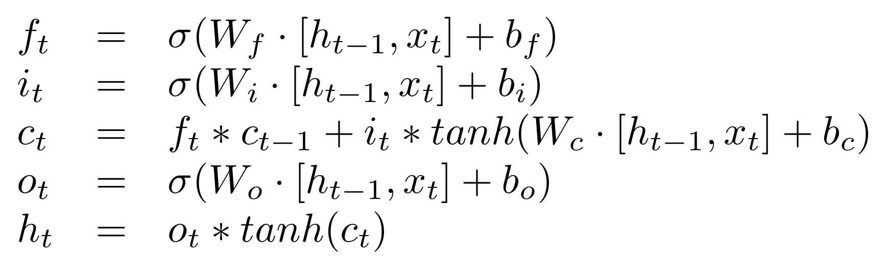
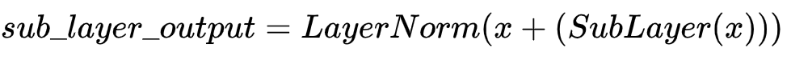
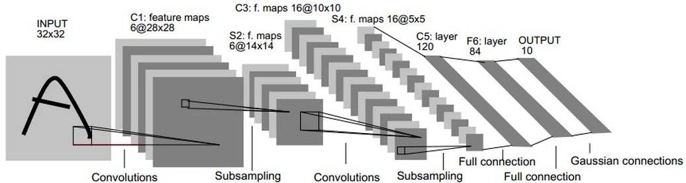

# 动手学深度学习第二次打卡

## 过拟合、欠拟合及其解决方案

在统计学中，拟合优度是指模型的预测值与观测值(真实)的匹配程度。一个学习了噪声而不是信号的模型被认为是“过拟合”的，因为它适合训练数据集，但与新数据集的拟合度较差。

当一个模型过于简单时，因为它的特性太少，或者过于正则化，就会出现欠拟合现象，这使得它在学习数据集时不够灵活。简单的模型在预测结果上往往有较小的方差和较大的偏差（见：偏差-方差权衡）。另一方面，复杂的模型往往在预测中有更大的方差。

如何避免过拟合？

在我们实际测试之前，我们无法知道模型对新数据的执行情况。为了解决这个问题，我们可以将初始数据集拆分为单独的训练和测试子集。如果我们的模型在训练集上比在测试集中表现得好得多，那么我们很可能会过拟合。如果我们的模型在训练集上有100％的准确率，但在测试集上只有50％的准确率，这就很有可能是过拟合导致的。

交叉验证是预防过拟合的一个强有力措施。

将初始训练数据拆分成多个数据集，使用这些拆分子集来调整模型。在标准的K-fold交叉验证中，我们将数据划分为K个子集，称为“折叠(folds)”。然后我们迭代地在K-1个折叠上训练算法，同时使用剩余的折叠作为测试集。

其余方法有提前终止训练、删除无用特征、清洗数据噪音、投入更多的数据，以及正则化，正则化是指人为地迫使模型变得更简单的一系列技术，根据模型不同，正则化的手段也有所区别。最后还有集成学习的方法可以降低单独模型过拟合带来的风险。

## 梯度消失、梯度爆炸

我采用给予反向传播算法的梯度下降学习的深度神经网络时，发现一个问题，那就是，不同层的学习速度差异很大。前面的层优化得很快，但是越往后学习得越慢。这种梯度消失问题，还有反过来梯度爆炸问题（在前面层的梯度变得非常大，以至于之后再也不能通过新样本改变梯度）一直困扰我。这一部分需要很多数学推导，之后我会将自己的思路曼曼列举出来。

## 循环神经网络

LSTM网络的计算单元被称为存储单元（memory cell），存储器块（memory block）或者简称单元（cell）。当描述MLPs时，术语“神经元”作为计算单元是根深蒂固的，因此它经常被用来指LSTM存储单元。LSTM单元由权重和门组成。

一个记忆单元具有输入、输出的权重参数，以及通过暴露于输入时间步长而建立的内部状态。输入权重。用于对当前时间步长的输入进行加权。输出权重。用于对上次步骤的输出进行加权。内部状态。在这个时间步长的输出计算中使用内部状态。

记忆单元的关键是门。这些也是加权函数，它们进一步控制单元中的信息。有三个门：遗忘门。决定什么样的信息需要从单元中丢弃。输入门。决定输入中哪些值来更新记忆状态。输出门。根据输入和单元的内存决定输出什么。

实现LSTM的过程中遇到了一些困难，我们可以直接利用TensorFlow内部封装好的api来实现。

## 机器翻译及相关技术

机器翻译（MT）：将一段文本从一种语言自动翻译为另一种语言，用神经网络解决这个问题通常称为神经机器翻译（NMT）。 主要特征：输出是单词序列而不是单个单词，且 输出序列的长度可能与源序列的长度不同；输入序列长度可变，输出序列长度可变。

## 注意力机制与Seq2seq模型

seq2seq模型，从表面意思了解，就是序列到序列的模型，即输入为序列，输出也为序列。

人脑的注意力机制本质上是一种注意力资源分配的模型，比如说我们在阅读一篇论文的时候，在某个特定时刻注意力肯定只会在某一行文字描述，在看到一张图片时，我们的注意力肯定会聚焦于某一局部。随着我们的目光移动，我们的注意力肯定又聚焦到另外一行文字，另外一个图像局部。所以，对于一篇论文、一张图片，在任意一时刻我们的注意力分布是不一样的。这便是著名的注意力机制模型的由来。早在计算机视觉目标检测相关的内容学习时，我们就提到过注意力机制的思想，目标检测中的 Fast R-CNN 利用 RoI（兴趣区域）来更好的执行检测任务，其中 RoI 便是注意力模型在计算机视觉上的应用。

注意力模型的使用更多是在自然语言处理领域，在机器翻译等序列模型应用上有着更为广泛的应用。在自然语言处理中，注意力模型通常是应用在经典的 Encoder-Decoder 框架下的，也就是 RNN 中著名的 N vs M 模型，seq2seq 模型正是一种典型的 Encoder-Decoder 框架。

## Transformer

和大多数seq2seq模型一样，transformer的结构也是由encoder和decoder组成。

Encoder由N=6个相同的layer组成，layer指的就是上图左侧的单元，最左边有个“Nx”，这里是x6个。每个Layer由两个sub-layer组成，分别是multi-head self-attention mechanism和fully connected feed-forward network。其中每个sub-layer都加了residual connection和normalisation，因此可以将sub-layer的输出表示为：

Decoder和Encoder的结构差不多，但是多了一个attention的sub-layer，这里先明确一下decoder的输入输出和解码过程：

输出：对应i位置的输出词的概率分布
输入：encoder的输出 & 对应i-1位置decoder的输出。所以中间的attention不是self-attention，它的K，V来自encoder，Q来自上一位置decoder的输出
解码：这里要特别注意一下，编码可以并行计算，一次性全部encoding出来，但解码不是一次把所有序列解出来的，而是像rnn一样一个一个解出来的，因为要用上一个位置的输入当作attention的query

除了主要的Encoder和Decoder，还有数据预处理的部分。Transformer抛弃了RNN，而RNN最大的优点就是在时间序列上对数据的抽象，所以文章中作者提出两种Positional Encoding的方法，将encoding后的数据与embedding数据求和，加入了相对位置信息。

## 卷积神经网络、leNet

卷积神经网络（Convolutional Neural Networks, CNN）是一类包含卷积计算且具有深度结构的前馈神经网络（Feedforward Neural Networks），是深度学习（deep learning）的代表算法之一。为了简化全连接层的计算参数，增强模型的泛化能力，在神经网络中引入了卷积操作。这其中的最典型模型莫过于Lenet-5.

LeNet-5包含七层，不包括输入，每一层都包含可训练参数（权重），当时使用的输入数据是32*32像素的图像。下图是网络结构图。

Lenet的代码实现见同文件夹下的ipynb文件。